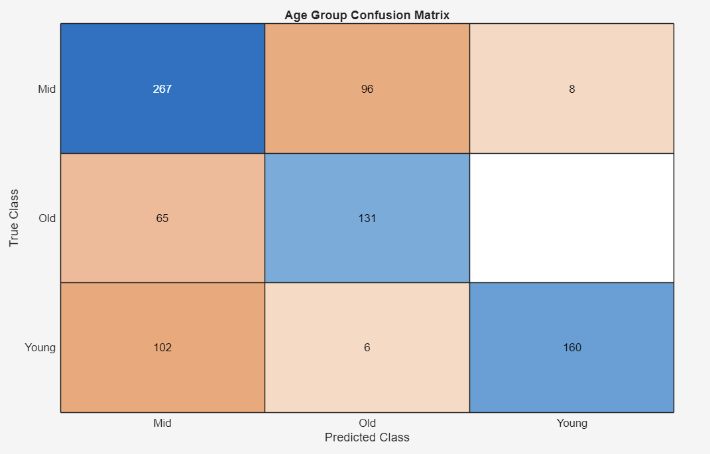

## Deliverable 1 

      Initial Prompt: I would like to do a machine learning project where the goal is to predict how old a snail is based on physical measurements. I have a spreadsheet with columns ‘sex’, ‘length’, ‘diameter’, ‘height’, 'whole weight', 'shucked weight', 'viscera weight', 'shell weight', and ‘rings’. There are approximately 4177 rows. I will ask for matlab code soon, but first: Can we talk about the best way to model this data set?

## Deliverable 2 

      Due to the fact that we are measuring and tracking biological data - snails, diameter, weight, etc. - our dataset is not going to be perfect and should vary a lot. I talked with my LLM about using two different methods: Gradient Boosting and Random Forest. In the end, Random Forest was the method that was recommended for many reasons. 
  
      First, we will be hardcoding values for the sex of each snail, as they are not numbers. Second, Random Forest accommodates data that is nonlinear - most likely where we will find ourselves. Third, his method is also good at finding correlations between variables, such as diameter and length, and making assumptions based on that knowledge. Finally, Random Forest is better for different types of data - this is useful in our case so we can combine length, weight, and sex in one dataset. Random Forest averages several results in the end so we have a quicker baseline of our data analysis. 
  
      In comparison, Gradient Boosting iterates and improves our results as we go. It is great for datasets with low variance in measurements requiring highly accurate analysis with low bias, however, as we are working with biological measurements, we will likely have more variance in our dataset. Overall, Random Forest proves itself to be the better method for analyzing our data.  

## Deliverable 3

      Initially, my LLM disliked the idea of using a confusion matrix. With creating the confusion matrix, we have to eliminate pieces of the data so the snails will fit into age categories. The matrix generated in my initial iteration of code is in a strange configuration that is confusing to interpret. I will have it rearrange the order of the matrix. However, this matrix is showing us that each blue bin is where the Random Tree method predicted the correct number in the category. Each orange box is where the method predicted the wrong number. The depth of the color helps to visualize the quantity of snails in each bin. 

## Deliverable 4

      I copy-pasted my results into my LLM and asked it what it could tell me about the inaccuracies and shortcomings of the code based on the results. I also asked it what I could do to improve my code. My LLM explained that the code isn't making catastrophic errors based on the orange numbers being smaller than the blue ones, however, I think there is a pretty significant error margin that could stand some fine tuning. The LLM noticed that the code tends to be more accurate, the younger the snail. The biggest problem is the confusion of what is classified as "Mid" class. The LLM thinks this is due to the potential overlap of ages that could be considered "Mid" class. 
      
      It also explains that this is caused by the code forcing 1/3 of the data into one class. "Nature doesn't work in thirds," it says. The LLM says it would be better to use a regression model rather than a classification model, as the smallest variance in data - diameter, length, sex, etc. - could cause it to go into the wrong class. "It exaggerates small numerical errors near thresholds."
      
      As for improvements, my LLM says we should keep RMSE (Root Mean Squared Error) in our code to tell us the quality of the prediction. We should also add buffer zones for our data to be separated in a more accurate way. I think a good way to do this would be with if and else statements, putting limits on the age groups that snails will be filed into. The LLM wants to use the Random Forest method to directly classify rather than use regression and binning. It also suggests increasing tree depth from the current 100 to a value between 200 and 500. The LLM thinks using ratios between categories of data would be better than our current separation of all data. For example, using a ratio of shucked weight to whole weight to improve our "Mid" class separation issue. 

      

